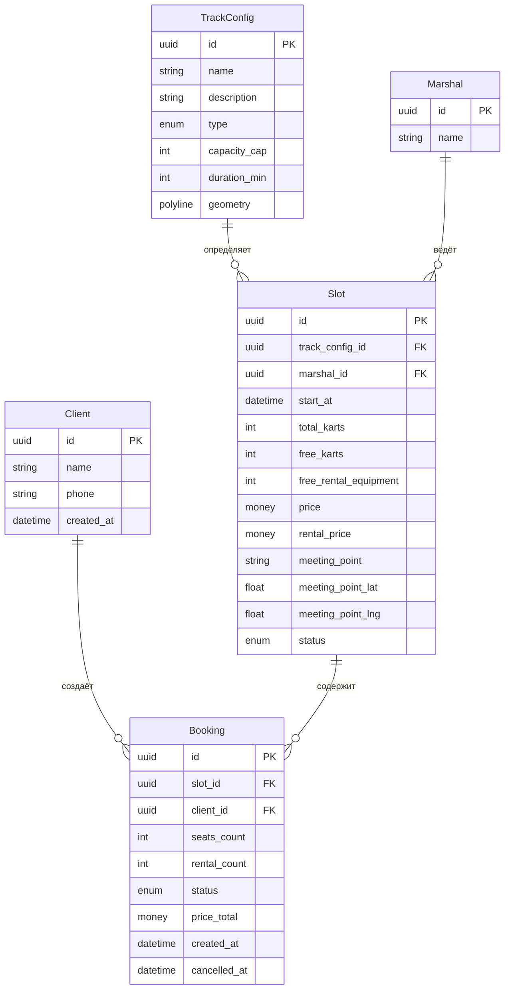
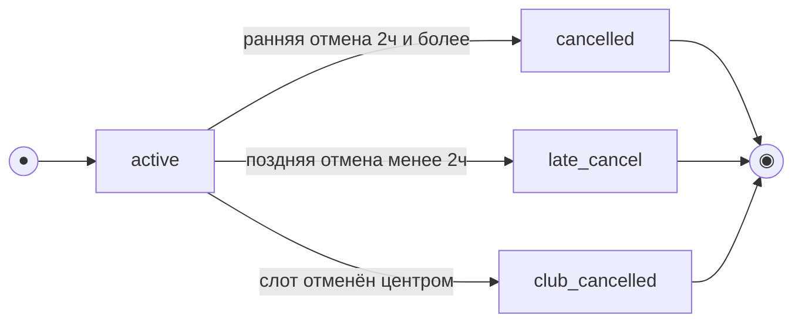
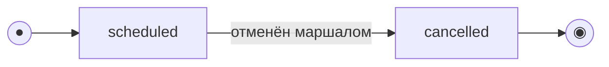

# Модель данных

Скоуп: **клиентское приложение и API для него.** Это **ресурсная модель API** (что клиент
читает/создаёт), а не схема БД, которую мы проектируем: хранение и бизнес-логика принадлежат
**существующей инфраструктуре**.

- **TrackConfig, Marshal, Slot** — read-only-проекция ресурсов существующего бэкенда; приходят
  через API, клиент их не создаёт и не редактирует.
- **Client, Booking** — ресурсы, которыми оперирует клиентский API (регистрация и бронирования).
- Сущности оценок/рейтингов в скоуп не входят (обеспечиваются существующей инфраструктурой).
- **Данные существующей инфраструктуры (R-015).** Проект учебный/тестовый, легаси-данных нет:
  эта модель (вместе с `rental_price`, `geometry`, `meeting_point`, `free_rental_equipment`)
  считается **канонической** и совпадает с контрактом API. Миграция/backfill и поведение при
  отсутствии полей не рассматриваются — бэкенд по условию отдаёт все поля модели.

## Архитектурный план

```
┌─────────────────────────────────────────────────┐
│             Клиентское приложение                │
│              (Flutter, iOS/Android)               │
│                                                   │
│  ┌─────────┐ ┌──────────┐ ┌──────────────────┐  │
│  │ UI Layer│ │ State    │ │ Repository Layer  │  │
│  │(Screens)│ │(BLoC/Rx) │ │ (API + Cache)     │  │
│  └─────────┘ └──────────┘ └──────────────────┘  │
│                                      │            │
└──────────────────────────────────────┼────────────┘
                                       │ HTTPS / REST
                                       │ JSON + JWT
                              ┌────────┴────────┐
                              │  Существующий    │
                              │    бэкенд        │
                              │ (black-box)      │
                              │                  │
                              │  - Слоты         │
                              │  - Бронирования  │
                              │  - Авторизация   │
                              │  - Админка       │
                              └──────────────────┘
```

**Компоненты клиентского приложения:**

1. **UI Layer** — экраны (Flutter Widgets): список слотов, карточка слота, оформление брони, мои бронирования, профиль, авторизация.
2. **State Management** — BLoC / Rx-подход: управление состоянием экранов, фильтры, кэш.
3. **Repository Layer** — абстракция над API: список слотов, создание/отмена брони, профиль, авторизация. Единый источник данных для UI. Реализует offline-first для чтения (кэш + пометка устаревания).
4. **API Client** — HTTP-клиент с JWT-авторизацией, идемпотентностью, матрицей ошибок.

**Границы:**

- Клиент **не управляет** расписанием, маршалами, конфигурациями трасс — только читает.
- Бэкенд — **black-box**: гарантии целостности (0 двойных броней) на его стороне.
- Клиентское приложение работает на **Flutter** для кроссплатформенности (iOS + Android).

## Сущности и атрибуты

### Client (Клиент)
| Атрибут | Тип | Описание |
| :-- | :-- | :-- |
| id | UUID (PK) | Идентификатор клиента |
| name | string | Имя |
| phone | string (unique) | Номер телефона — логин; вход подтверждается кодом из SMS (OTP) |
| created_at | datetime | Дата регистрации |

Вход/регистрация — трёхшаговый поток (телефон → код из SMS → имя для нового пользователя).
Сам код подтверждения (OTP) и его проверка — на стороне бэкенда, отдельной сущностью в модели не хранится. Смена телефона в профиле также подтверждается кодом.

История броней и удаление аккаунта (R-025). Клиенту доступна **вся история** своих
броней (активные, отменённые, поздние, отменённые центром, прошедшие) — `listBookings`
отдаёт её **постранично** (пагинация, `limit`/`offset`).

Переход состояний при `deleteAccount` (R-006). При удалении аккаунта:
- **Активные брони** (`status = active`) переводятся в `cancelled` (системная отмена):
  проставляется `cancelled_at`, **освобождаются карты и прокатная экипировка** в слоте — как при
  обычной ранней отмене (`free_karts += seats_count`, `free_rental_equipment += rental_count`).
- **Прошедшие / завершённые брони** сохраняются обезличенными (для учёта).
- **ПДн клиента** (`name`, `phone`) **анонимизируются**, а не удаляются жёстко; `Client.phone`
  **освобождается** для повторной регистрации.
- **История** связанных броней **сохраняется обезличенной** (для учёта/статистики
  существующей инфраструктуры).

### TrackConfig (Конфигурация трассы) — справочник, read-only
| Атрибут | Тип | Описание |
| :-- | :-- | :-- |
| id | UUID (PK) | Идентификатор конфигурации трассы |
| name | string | Название |
| description | string? (nullable) | Описательный текст трассы/заезда для карточки слота. Опциональный; может отсутствовать или быть `null` |
| type | enum (`novice`/`experienced`) | Тип: новичковая / опытная |
| capacity_cap | int | Потолок картов (новичковая ≤8, опытная ≤14) |
| duration_min | int | Длительность, мин (≈15–20) |
| geometry | polyline | Геометрия трассы для выделенной линии на карте: массив координат `[lat,lng]` либо encoded polyline. Используется для карты Яндекс |

### Marshal (Маршал) — справочник, read-only
| Атрибут | Тип | Описание |
| :-- | :-- | :-- |
| id | UUID (PK) | Идентификатор маршала |
| name | string | Имя маршала |

### Slot (Слот / заезд) — предзаполняется, read-only для клиента
| Атрибут | Тип | Описание |
| :-- | :-- | :-- |
| id | UUID (PK) | Идентификатор слота |
| track_config_id | FK → TrackConfig | Конфигурация трассы |
| marshal_id | FK → Marshal | Назначенный маршал |
| start_at | datetime (UTC) | Дата и время старта в UTC; **хранится в UTC**, **источник истины — сервер**. Клиент отображает в **локальной зоне центра**, но право/тип отмены (правило 2 часов) вычисляет сервер (R-021) |
| total_karts | int | Всего картов (≤ capacity_cap трассы) |
| free_karts | int | Свободно картов (расчётное/денормализованное) |
| free_rental_equipment | int | Свободно прокатных комплектов экипировки |
| price | money (RUB) | Цена за место (валюта — рубли) |
| rental_price | money (RUB) | **Отдельный тариф проката** за один комплект экипировки (отдельно от `price`); своя экипировка бесплатна. Итог брони = `price × seats_count + rental_price × rental_count`. Валюта — рубли (R-010) |
| meeting_point | string | **Место сбора** (адрес/ориентир) — обязательное |
| meeting_point_lat | float | Широта точки сбора — пин на карте трассы |
| meeting_point_lng | float | Долгота точки сбора — пин на карте трассы |
| status | enum (`scheduled`/`cancelled`) | Статус слота |

### Booking (Запись / бронь)
| Атрибут | Тип | Описание |
| :-- | :-- | :-- |
| id | UUID (PK) | Идентификатор записи |
| slot_id | FK → Slot | Слот |
| client_id | FK → Client | Кто записал |
| seats_count | int | Число мест в записи (1–3: себя + гости). Только агрегат, без сущности BookingSeat (R-013) |
| rental_count | int | Сколько из мест — на прокатной экипировке (0..seats_count). Агрегат, без BookingSeat (R-013) |
| status | enum (`active`/`cancelled`/`late_cancel`/`club_cancelled`) | Статус записи. `club_cancelled` — **«Отменён центром»**: возникает, когда слот отменён центром (`Slot.status = cancelled`); клиент видит бронь как отменённую не по своей инициативе (R-008). Название enum сохранено для единообразия контракта. |
| price_total | money (RUB), read-only | **Итоговая цена, рассчитанная и возвращаемая сервером** (read-only). Клиент использует её как есть и **не пересчитывает**; `price`/`rental_price` лежат в связанном `slot`. Цена **фиксируется на момент брони** (R-005, R-010) |
| created_at | datetime | Время создания |
| cancelled_at | datetime? | Время отмены (если была) |

Примечание: по гостям хранятся **только** агрегаты `seats_count` и `rental_count` — отдельной
сущности `BookingSeat` (вариант/имя по каждому гостю) в скоупе **нет** (R-013). Вариант экипировки
выводится из `rental_count` (прокатные места) и `seats_count − rental_count` (своя экипировка).

Итоговая цена `price_total` рассчитывается на сервере и приходит в ответе API как read-only
(R-005). Клиент **не пересчитывает** её, а отображает; исходные тарифы `price`/`rental_price`
лежат в связанном `slot`. Расчёт сервера: `price × seats_count + rental_price × rental_count`,
валюта — рубли; **цена фиксируется на момент создания брони** (R-010).

«Прошедшая» — не хранимый статус. Бейдж «Прошедшая» и группа «Прошедшие» —
**производное отображение** по `Slot.start_at` в прошлом, а не значение
`Booking.status`. Статус остаётся `active`/`cancelled`/`late_cancel`; «прошедшесть»
вычисляется из времени старта. См. [модель состояний](#модель-состояний-жизненный-цикл).

Статусы `no_show` и сущности оценок (`Rating`) в скоуп клиентского приложения не входят —
относятся к существующей инфраструктуре (отметка явки / «заезд состоялся»).

Карта трассы: `TrackConfig.geometry` (полилиния) рисует выделенную линию, `Slot.meeting_point*`
задаёт пин и текст места сбора. Источник тайлов и ключ Яндекс.Карт (Static API / Maps JS API) — параметр конфигурации, в модель не входит.

## ERD



## Модель состояний (жизненный цикл)

Две сущности имеют явный жизненный цикл: **Booking** (управляется клиентским API) и
**Slot** (read-only-проекция; переходы выполняет существующая инфраструктура, клиент только
читает текущий статус). Состояние **«Прошедшая»** у обеих — **производное** (вычисляется по
`Slot.start_at` относительно текущего времени), а не отдельное значение enum.

### Booking (Запись / бронь)

`status ∈ {active, cancelled, late_cancel, club_cancelled}`. Создаётся в `active`; отмена —
терминальный переход (повторная отмена не выполняется). Какой именно переход (ранняя/поздняя отмена) — определяется **сервером** по времени до старта на
момент отмены (`slot.start_at` в UTC — источник истины); граница «ровно 2 часа» трактуется как
**ранняя** (`≥ 2 ч`, R-021).
Отдельно: при отмене **слота центром** (`Slot.status → cancelled`) связанные брони переходят в
`club_cancelled` — **«Отменён центром»** (отмена не по инициативе клиента, R-008); карты/экипировка в
слоте при этом не релевантны (слот снят).



«Прошедшая» — производное отображение (`slot.start_at` в прошлом), не отдельный статус;
отмена недоступна после старта. Трасса переходов — в таблице ниже.

| Из | Событие / условие | В | Эффект на слот | Трасса |
| :-- | :-- | :-- | :-- | :-- |
| — | Клиент подтверждает бронь | `active` | `free_karts −= seats_count`; `free_rental_equipment −= rental_count` | UC-1, FR-10 |
| `active` | Отмена, до старта `≥ 2 ч` | `cancelled` | Карты и экипировка **возвращаются** в слот | UC-2, FR-17 |
| `active` | Отмена, до старта `< 2 ч` | `late_cancel` | Карт и экипировка **НЕ освобождаются**, штрафов нет | UC-2 A1, FR-18 |
| `active` | Слот отменён центром (`Slot.status → cancelled`) | `club_cancelled` | Слот снят; клиент уведомляется (push), запись закрыта не по своей инициативе | R-008, FR-33 |
| `cancelled` / `late_cancel` / `club_cancelled` | — (терминальные) | — | Повторная отмена не выполняется | UC-2 E2 |

Отмена возможна только пока заезд не начался (`start_at` в будущем) — после старта CTA
недоступна. Статус `no_show` (неявка) — вне скоупа клиентского приложения (существующая инфраструктура).

### Slot (Заезд / слот)

`status ∈ {scheduled, cancelled}` — read-only для клиента. Переход в `cancelled` инициирует
владелец/маршал в существующей инфраструктуре (массовое уведомление участников — вне скоупа
клиента, [FR-33](../2-requirements/functional-requirements.md)). Клиент видит статус и реагирует
на UI: при `cancelled` запись недоступна.



«Прошедшая» — производное (`start_at` в прошлом). Отметка явки / «заезд состоялся» — вне
скоупа клиента (существующая инфраструктура).

| Статус | Что видит клиент | Запись |
| :-- | :-- | :-- |
| `scheduled` (старт в будущем) | Слот в списке/карточке; при `free_karts = 0` — пометка «Мест нет» | Доступна при `free_karts > 0` |
| `scheduled` (старт в прошлом) — *производное «Прошедшая»* | В клиентских сценариях не предлагается к записи | Недоступна |
| `cancelled` | Пометка «Заезд отменён» / «Слот недоступен» | Недоступна / скрыта |

## Ключевые инварианты (целостность данных)

- `Slot.free_karts = Slot.total_karts − Σ(active+late_cancel bookings.seats_count)` — карт при поздней отмене НЕ освобождается.
- `Slot.total_karts ≤ TrackConfig.capacity_cap` (новичковая ≤8, опытная ≤14).
- `Slot.free_rental_equipment = исходный прокатный фонд слота − Σ(active+late_cancel bookings.rental_count)` — экипировка при поздней отмене тоже НЕ освобождается (экипировка простаивает, см. домен); общий прокатный фонд центра — 14 комплектов.
- Только **ранняя** отмена возвращает карты и прокатную экипировку в слот (`cancelled`); `late_cancel` удерживает и карт, и экипировку (FR-17/FR-18).
- Запись/отмена выполняются атомарно: овербукинг и двойная бронь исключены при параллельных операциях (NFR-8, NFR-9).
